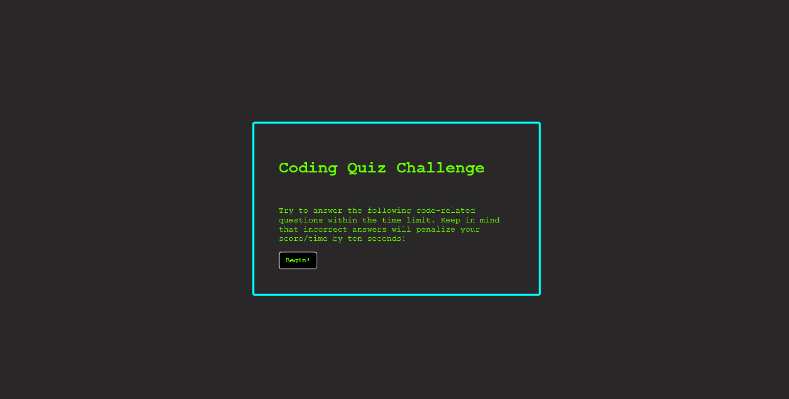
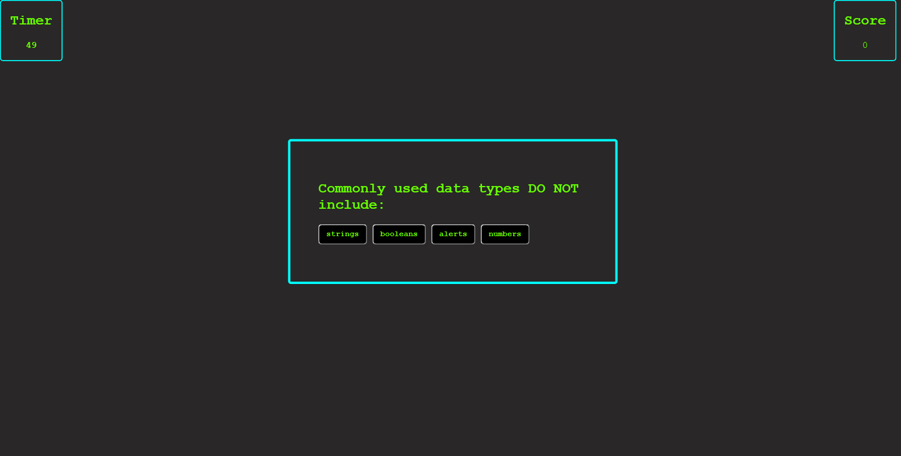
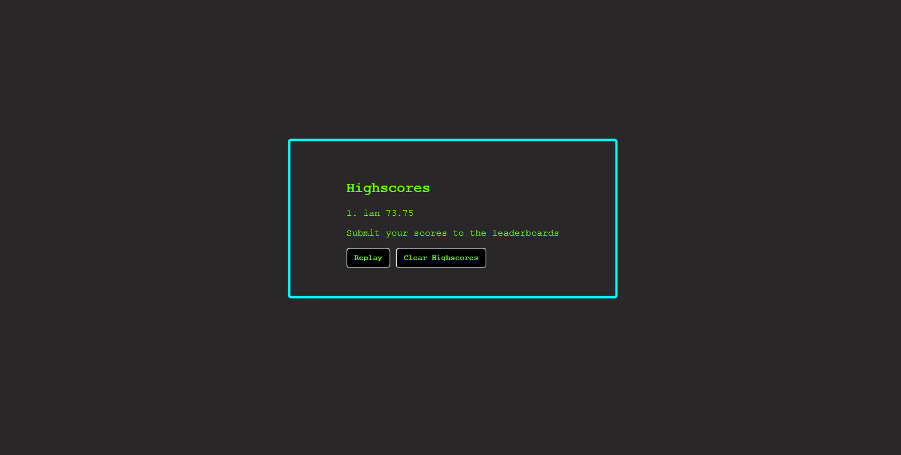

# JS Quiz

## Description

I was tasked with creating a short quiz on JavaScript concepts that would be able to store users' highscores in local storage, and then display them when asked. The user is also able to clear every item both from local storage and the webpage if they choose. I also implemented a replay button that would allow the user to cycle through the quiz again and try to beat their high score.

## Links

- [Deployed Webpage](https://en-moss.github.io/04-JS-Quiz/ "Deployed Webpage")

## Screenshot

